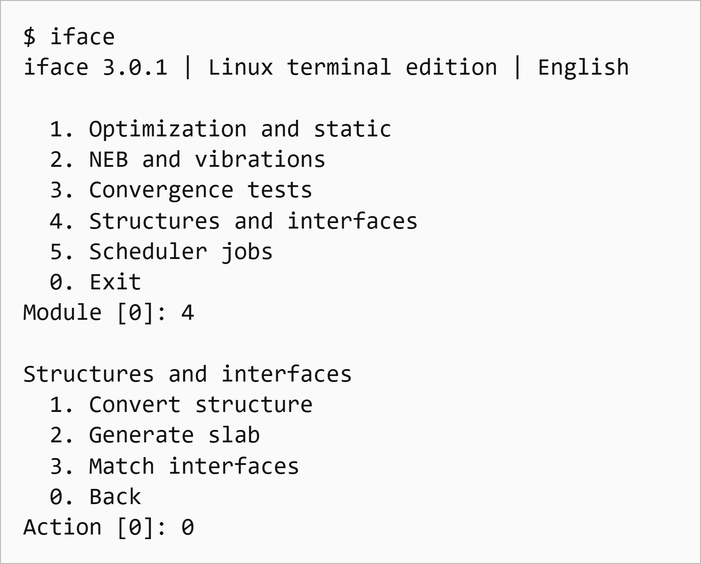
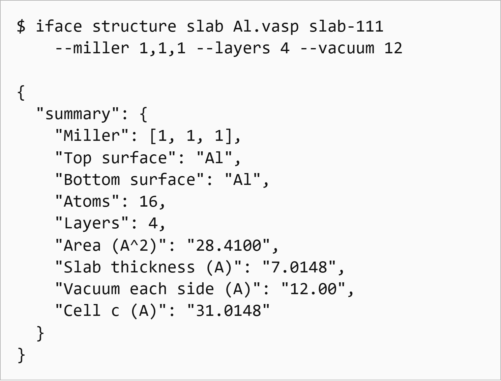

# iface - VASP workflows for the Linux terminal

[](https://github.com/liruanlin-beep/iface-linux/actions/workflows/linux.yml)

**Version 3.0.1** | [Examples](docs/EXAMPLES.md) | [Python API](docs/API.md) |
[Validation](VALIDATION.md) | [Contributing](CONTRIBUTING.md) | [Changelog](CHANGELOG.md)

[Download release](https://github.com/liruanlin-beep/iface-linux/releases/latest) |
[Report an issue](https://github.com/liruanlin-beep/iface-linux/issues) |
[Cite the software](CITATION.cff) | [MIT license](LICENSE)

iface provides numbered terminal menus, scriptable commands and a Python API for
VASP calculations on Linux workstations and HPC login nodes. It requires no X11,
Wayland, Tkinter or browser. Every built-in menu, prompt, error and guide is in
English. User filenames, structure titles and external program output are retained.

This repository contains the independent Linux terminal edition of iface.
Its crystal conversion, slab generation and interface matching engines are
adapted from the original iface desktop implementation.
The terminal workflow modules implement the OS / NEB / Test organization described
in [the VaspCZ paper](https://zhangzhengde0225.github.io/files/2020-ZZD-VaspCZ.pdf).
No VaspCZ source code or VASP executables/pseudopotentials are bundled.

| Workflow | What iface provides |
| --- | --- |
| Optimization and static | Input presets, exact POTCAR selection, preflight and result inspection |
| NEB and vibrations | Periodic linear interpolation, barrier reports and harmonic prefactor checks |
| Convergence tests | ENCUT and k-point sweeps with energy comparisons |
| Structures and interfaces | CIF conversion, surface slabs and geometric interface candidates |
| Scheduler jobs | Explicit Slurm/PBS submission, status, cancellation and duplicate protection |



*An actual terminal session, formatted as an output excerpt. The working-directory
line is omitted.*

## Install on Linux

Download the source tarball from [Releases](https://github.com/liruanlin-beep/iface-linux/releases),
or clone the repository:

```bash
git clone https://github.com/liruanlin-beep/iface-linux.git
cd iface-linux
bash install.sh --structures
```

Requirements: Python 3.10 or newer, `venv`, `pip`, and NumPy. On distributions
that split Python packages, install their `python3-venv`/`python3-pip` packages
first. A C/Fortran compiler is not needed when compatible wheels are available.

```bash
tar -xzf iface-linux-3.0.1.tar.gz
cd iface-linux-3.0.1
bash install.sh --structures
export PATH="$HOME/.local/share/iface/terminal-3.0/bin:$PATH"
iface
```

`--structures` installs pymatgen for CIF conversion, slab generation and interface
matching. Omit it for the smaller OS/NEB/Test installation. The installer honors
`XDG_DATA_HOME` and `IFACE_VENV`; use the exact PATH printed by the installer if
either variable changes the installation directory. It does not modify shell
startup files. Installation downloads dependencies from the configured Python
package index. Offline clusters can install predownloaded compatible wheels.

Alternatively, install into your own environment:

```bash
python3 -m venv .venv
. .venv/bin/activate
python -m pip install '.[structures]'
iface --help
python -m iface --version
```

For a repository checkout, run the environment commands above from the directory
containing `pyproject.toml`. For an archive, extract it first; GitHub-generated
source archives may use a different top-level directory name.

## Try it without VASP

From the repository root after installing the `structures` extra:

```bash
iface structure slab examples/Al/POSCAR demo-slab \
  --miller 1,1,1 --layers 4 --vacuum 12
iface os prepare examples/Al/POSCAR demo-static \
  --preset static --mesh 7x7x7
iface os results demo-static
```

These commands generate geometry and input files without submitting a job or
running VASP. Use new output directory names on repeat runs. The static example
has no POTCAR and cannot pass submission preflight until you add your own licensed
potential. Its result report correctly contains no calculated energy.

[Reproducible examples](docs/EXAMPLES.md) include a conventional FCC Al cell,
an Al(111) slab, two interface candidates and synthetic parser checks.



*Actual output from the conventional-cell example. The excerpt omits the output
directory and termination description and wraps long lines for readability.*

## Interactive use

Run `iface` in a terminal and choose a module:

```text
  1. Optimization and static
  2. NEB and vibrations
  3. Convergence tests
  4. Structures and interfaces
  5. Scheduler jobs
  0. Exit
```

Each action displays its arguments, prompts for paths and accepts optional flags.
Paths entered at dedicated prompts do not need quoting; paths in the options
line must be quoted when they contain spaces. In a pipeline, `iface` prints help
instead of waiting for interactive input. Run subcommands for batch scripts.

## Optimization and static calculations

Use your own licensed POTCAR library, arranged as `LIBRARY/Al/POTCAR`,
`LIBRARY/Fe_pv/POTCAR`, etc. Potential selection is exact; the program never
silently replaces a standard potential with an `_sv`, `_pv` or `_GW` variant.

```bash
iface os prepare examples/Al/POSCAR al-relax \
  --preset relax --encut 520 --mesh 7x7x7 \
  --potcar-root /path/to/licensed/paw_pbe \
  --scheduler slurm --partition compute --tasks 16
iface os check al-relax
iface jobs submit al-relax --yes
iface jobs status
iface os results al-relax
```

Preparation creates `POSCAR`, `INCAR`, `KPOINTS`, `job.sh`, a provenance manifest,
and `POTCAR` when a library is supplied. Without a library, input preparation
still works, but preflight rejects submission until a valid POTCAR is added.
Review the INCAR preset, mesh, VASP executable, resource count and cluster module
setup before submission. The defaults are starting points, not material-specific
convergence recommendations. Supported presets are `relax`, `surface`, `static`,
`pdos` and `charge`.

After relaxation completes and you have checked convergence:

```bash
iface os static al-relax al-static
iface os check al-static
iface jobs submit al-static --yes
iface os results . --recursive --csv > results.csv
```

Static conversion uses CONTCAR and preserves the source physical settings,
including functional, spin, pseudopotentials and smearing. It changes the
optimization controls and removes NEB-specific controls. It does not submit.

Result reports identify the energy source: the last parsed OUTCAR TOTEN takes
priority; otherwise the last OSZICAR F value is used. A final force norm is
reported only when the last force table contains the expected number of atoms,
established from NIONS or POSCAR. Missing, conflicting or incomplete atom counts
produce a null force and a warning rather than a value from an earlier table.

Individual file generators:

```bash
iface os kpoints KPOINTS.new --mesh 9x9x9 --mode Gamma
iface os potcar POSCAR /path/to/licensed/paw_pbe POTCAR.new --variants Al
iface os script job.new.sh --scheduler pbs --partition workq --tasks 16
```

The PBS script uses PBS Professional/OpenPBS `select` resource syntax; review it
for your site's MPI launcher and resource policy. The Slurm script uses `srun`.
Preflight currently accepts automatic Gamma/Monkhorst-Pack meshes and VASP 5
POSCAR files with explicit elements. It validates structural consistency and
input metadata, not the integrity/licensing of pseudopotential datasets or
physical correctness of a model.

## NEB and vibrations

Relax both endpoints with consistent cell, composition, atom ordering and
constraints. Compute endpoint static energies separately. Then prepare the path:

```bash
iface neb prepare initial/CONTCAR final/CONTCAR static-template diffusion-neb \
  --images 5
iface os check diffusion-neb
iface jobs submit diffusion-neb --yes
iface neb results diffusion-neb
```

This creates `00` through `06` for five intermediate images. Periodic shortest
displacements are used by default, including in skewed cells. Use `--no-wrap`
when the explicitly unwrapped endpoint displacement describes the intended path.
Interpolation is linear, not IDPP; check atom correspondence and collisions.
`--climb` writes `LCLIMB`; use a compatible VASP/VTST build. Review the MPI process
allocation against the image count. The tool does not infer atom permutations.

Copy the separately computed endpoint OUTCAR/OSZICAR files into `00` and the final
image directory when inspecting barriers. Missing energies remain null. An
available barrier is provisional until the calculation is converged; normal VASP
termination is not treated as proof of convergence.

```bash
iface neb vibration initial/CONTCAR static-template initial-vib --atoms 1 2
iface neb vibration saddle/CONTCAR static-template saddle-vib --atoms 1 2
# Inspect and submit these calculations explicitly, then:
iface neb frequency initial-vib saddle-vib
```

Moving atom indices are one-based. Vibrational input uses IBRION=5, NFREE=2 and
selective dynamics. The harmonic Vineyard prefactor requires matching active
degrees of freedom, no initial-state imaginary modes, exactly one saddle
imaginary mode and no zero modes (the real-frequency cutoff is 1e-6 THz).
Both calculation directories must include valid POSCAR files with matching
element order and per-atom directional selective-dynamics flags. Each frequency
count must match the active degrees of freedom. These checks do not establish
same-element atom correspondence or a common physical model; review those
conditions separately. There is no quantum correction.

## Convergence tests

Start with a fixed-geometry static calculation (NSW=0):

```bash
iface test encut al-static encut-scan --values 400 450 500 550 600
iface test kpoints al-static kpoint-scan --values 3x3x3 5x5x5 7x7x7 9x9x9
```

The commands generate independent directories and a manifest. They do not submit
the entire sweep automatically. Submit reviewed cases individually with
`iface jobs submit CASE --yes`; respect your cluster's job limits.

```bash
iface test results encut-scan --tolerance 1.0
```

The report compares energies in meV/atom with the largest ENCUT or highest mesh
point count in the sweep. Use componentwise increasing meshes with consistent
centering/aspect ratio. If the reference calculation has not finished, deltas
remain null. This is an energy screening report, not a claim of proven electronic
convergence or a universal recommended cutoff.

## Original iface structures and interfaces

Install the `structures` extra first:

```bash
iface structure convert crystal.cif POSCAR.new
iface structure slab bulk.vasp slab-111 --miller 1,1,1 --layers 6 --vacuum 15
iface structure interface substrate.vasp film.vasp interface-scan \
  --substrate-miller 1,0,0 --film-miller 1,0,0 \
  --substrate-layers 6 --film-layers 6 --gaps 2.0 2.5 3.0 \
  --max-strain 0.05 --max-area 500 --max-atoms 1000 --limit 24
```

Each candidate contains a POSCAR; the manifest records geometric scores, strain,
area, gap and registry. These scores do not establish thermodynamic stability.
Fractionally occupied structures are rejected until the user resolves their
ordering. Structures are limited to 1000 atoms; scans to 300 candidates.

## Files, jobs and recovery

- Outputs use new names/directories. Existing files are not overwritten.
- Work is stored only at paths you pass; this edition reads no Windows settings,
  saved passwords or API keys. No credentials are needed for local scheduler use.
- Run on the HPC login node, or connect using your normal SSH client first.
- `jobs submit` requires `--yes`, reruns preflight and creates a durable exclusive
  `.iface-submission.json` record before contacting Slurm/PBS. A repeat submission
  in that directory is refused.
- A timeout, interrupted submission or unrecognized scheduler reply leaves an
  `unknown` record. Check `squeue`/`sacct` or `qstat` with your cluster administrator
  if necessary; never delete the record merely to force a retry. Once the previous
  job is reconciled, prepare a distinct reviewed retry directory.
- `iface jobs cancel JOB_ID --yes` requests cancellation of that specific job.
- `iface os clean RUN` previews cleanup. Add `--apply` to move outputs into
  `RUN/.iface-archive/TIMESTAMP`; inputs are retained. Add `--keep FILENAME` for
  additional files. Cleanup is blocked while a submission record exists. NEB
  rollback is not automatic; preserve complete calculations and prepare a new run.
- Exit codes: 0 for successful commands, 2 for invalid inputs/preflight failure,
  130 for interruption. Results, manifests and API data use explicit null values
  for unavailable measurements.

## Python API and validation

```python
from iface import api

report = api.inspect_calculation("al-static")
checks = api.preflight("al-static", scheduler="slurm")
# This changes real cluster state; call only after reviewing the inputs:
# job = api.submit("al-static", scheduler="slurm", confirmed=True)
```

See the [API reference](docs/API.md) and [API workflow example](examples/api_workflow.py).
Run offline tests from the repository root with:

```bash
python -m unittest discover -s tests -v
```

The tests use synthetic VASP metadata, mocked scheduler commands and, when the
`structures` extra is installed, real pymatgen geometry operations. They never
run VASP or connect to a cluster and contain no licensed potentials. See
[VALIDATION.md](VALIDATION.md) for the checks actually executed for this release.

This release does not port the Windows 3D viewer, SSH file browser, DeepSeek
assistant, persistent GUI task database or publication-figure exporters. It
provides the terminal workflows above and the original structure engines.
It does not claim feature-for-feature equivalence to either desktop iface or
VaspCZ; it does not implement automatic NEB rollback, automatic image-count
selection or automatic multistage job chaining.

## Reference and license

The OS / NEB / Test menu organization takes functional inspiration from the
[VaspCZ article](https://zhangzhengde0225.github.io/files/2020-ZZD-VaspCZ.pdf).
iface is a separate implementation with its own structure tools and validation;
this reference does not imply affiliation or equivalent functionality.

See [LICENSE](LICENSE) for the software license. External dependencies retain
their own licenses. VASP and its pseudopotential datasets are separate products.
