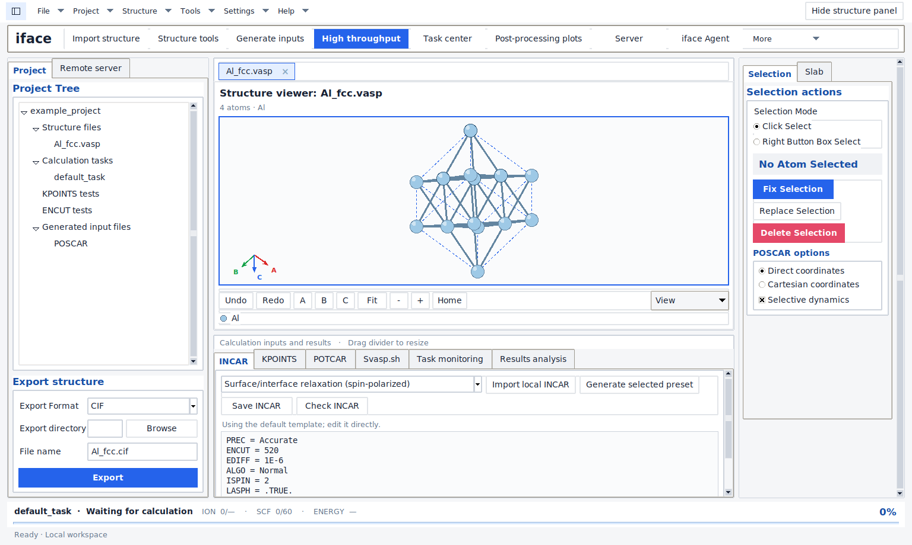

# iface for Linux

**4.0.0 — the complete desktop application.** This release ports the author's
original iface Windows application to Linux, preserving its structure viewer,
surface/interface modeling, layer and separation controls, VASP inputs,
dependent workflows, task center, results, SSH/SFTP and AI assistant.
It replaces the reduced 3.x terminal edition. The desktop opens in English.



The screenshot uses an illustrative Al structure; it is not a calculated result.

## Install and launch

Use a Linux desktop with Python 3.12 or newer and Tk. Ubuntu 24.04 is the tested
distribution. Wayland sessions require XWayland for Tk. On Ubuntu/Debian:

```bash
sudo apt update
sudo apt install python3-venv python3-tk xdg-utils openssh-client gnome-keyring
```

Download and extract the source archive from the
[latest release](https://github.com/liruanlin-beep/iface-linux/releases/latest),
open a terminal in that directory, and run:

```bash
bash install.sh
```

The installer creates a private virtual environment and a desktop launcher.
It prints the launch command and installation paths. An internet connection is
needed to install Python dependencies. For manual installation:

```bash
python3 -m venv ~/.local/share/iface/venv
~/.local/share/iface/venv/bin/python -m pip install .
~/.local/share/iface/venv/bin/iface
```

The release wheel is an alternative to installing `.` in an existing Python
3.12+ virtual environment. System Tk and a graphical session are still required.

## Original workflow

1. Import CIF, POSCAR or CONTCAR and inspect/edit the structure in the 3D viewer.
2. Build surfaces or pair materials A/B. Set their layer ranges, orientation,
   matching limits, lateral offsets and interface separation ranges.
3. Preview and export candidates, prepare input files and configure your POTCAR
   library and remote server.
4. Submit the original dependent calculations and monitor them in the task
   center. Inspect results, rank scans, calculate surface energy and export
   PDOS or charge-difference figures/data.

All original calculation templates and the controlled DeepSeek assistant remain
available. See [FEATURE_PARITY.md](FEATURE_PARITY.md) for the complete inventory
and the exact scope of the original CI-NEB input template.

## Linux integration

- Files and folders open with `xdg-open`. Remote-file editing uses the configured
  `editor_command`, then `$VISUAL`/`$EDITOR`, or the desktop file association.
- The external SSH action uses a native terminal and `ssh`. Install a terminal
  emulator or set `ssh_terminal_command` in the configuration if needed.
- Settings, projects, tasks and output are stored under
  `${XDG_DATA_HOME:-$HOME/.local/share}/iface/2.0`; the `2.0` directory identifies
  the retained Windows data format. `IFACE_DATA_DIR` overrides this location.
- Saved API keys use the desktop user's unlocked Secret Service keyring. Windows
  DPAPI-encrypted keys must be entered again on Linux. Settings contain a keyring
  reference rather than the saved secret.
- Drag-and-drop uses the packaged `tkinterdnd2` runtime. Fonts, paths, window
  sizing, scrolling and file/terminal opening are adapted for Linux.

VASP, licensed POTCAR datasets and a cluster account must be supplied by the
user, as in the Windows application. No manuscript or research results are
included in this repository.

## Verification and development

```bash
python -m unittest discover -s tests -v
iface --self-test /tmp/iface-acceptance.json
```

Use `xvfb-run -a` before these commands for headless testing. The self-test uses
isolated synthetic data and does not submit calculations. Detailed evidence and
the limits of local validation are in [VALIDATION.md](VALIDATION.md).

The original implementation is in `app/core` and `app/ui`; packaged resources
are in `app/resources`. [WINDOWS_BASELINE.json](WINDOWS_BASELINE.json) records the
original source hashes. See [NOTICE.md](NOTICE.md) for provenance and dependency
licensing, and [CHANGELOG.md](CHANGELOG.md) for the release scope.
