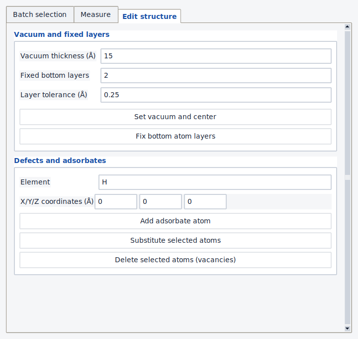
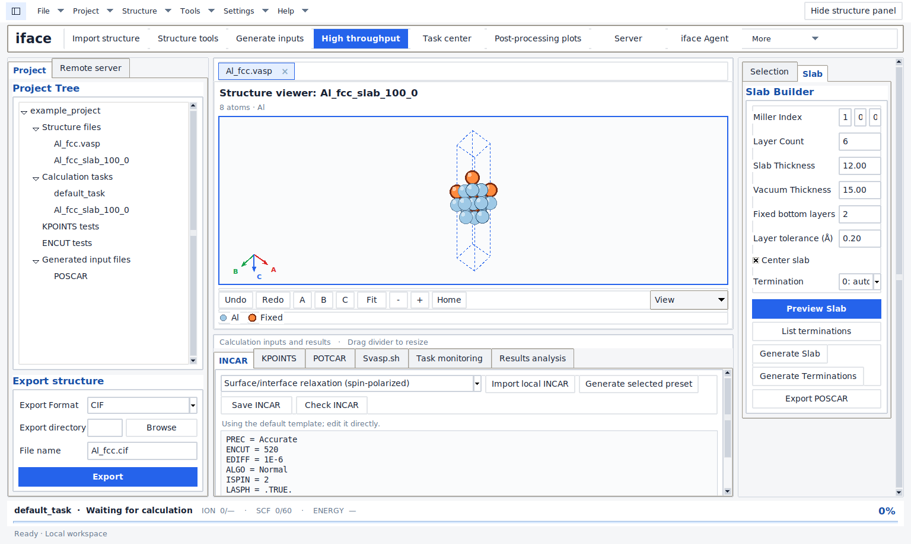
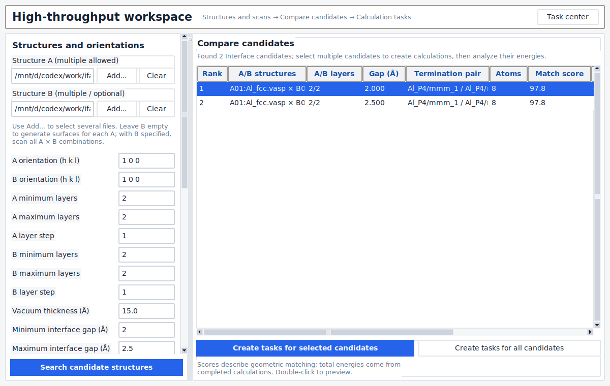
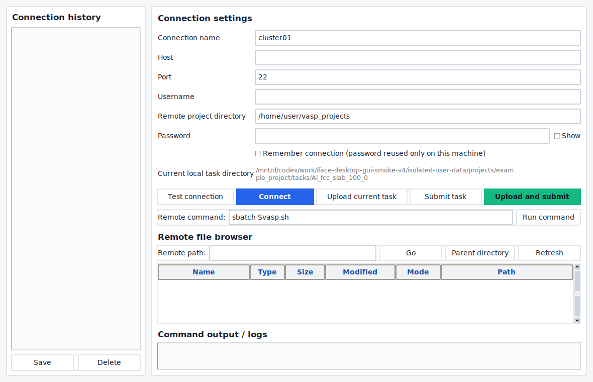
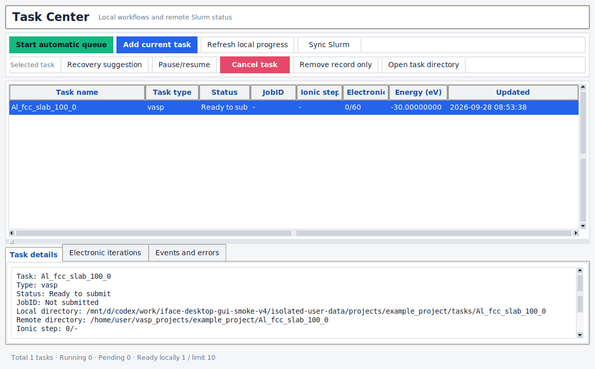
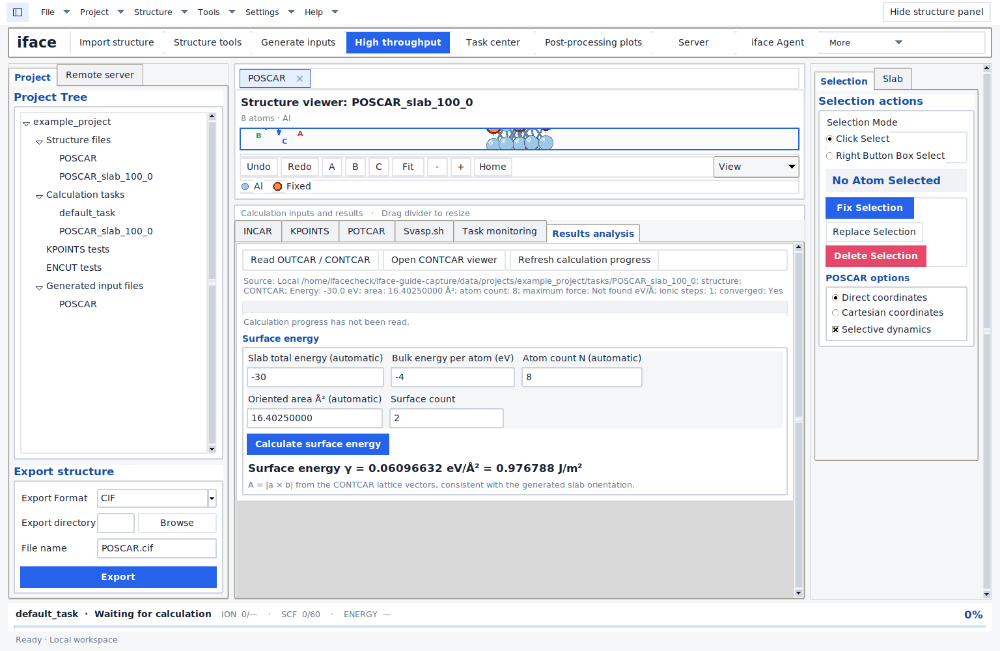
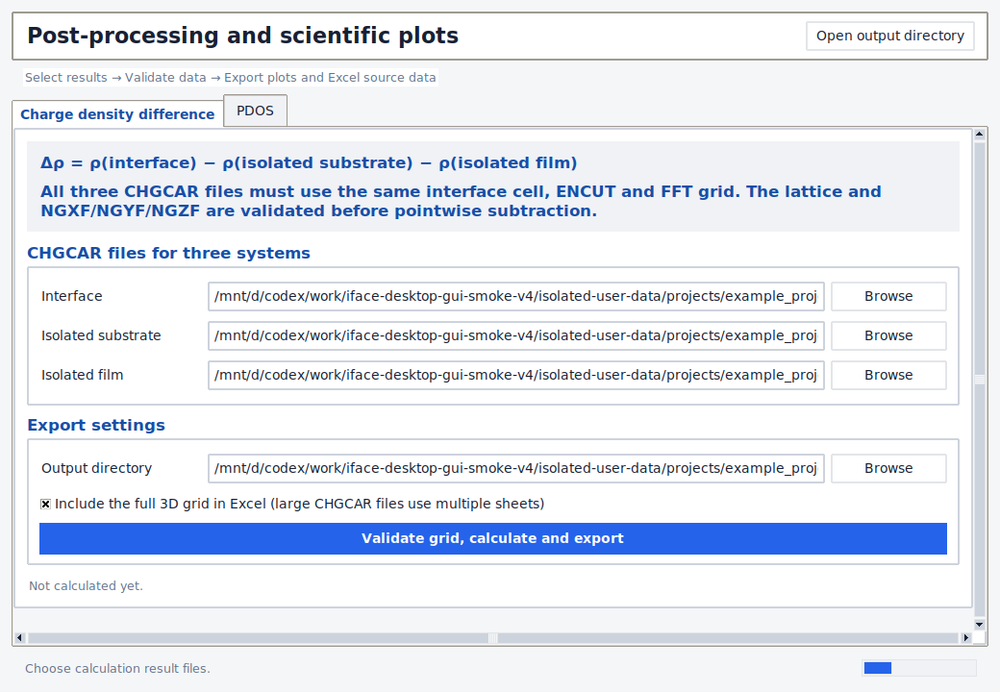
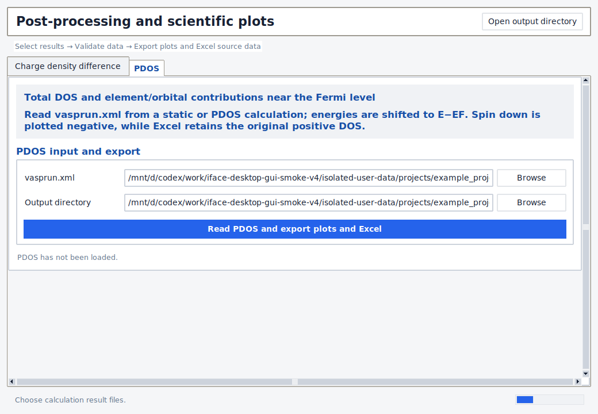
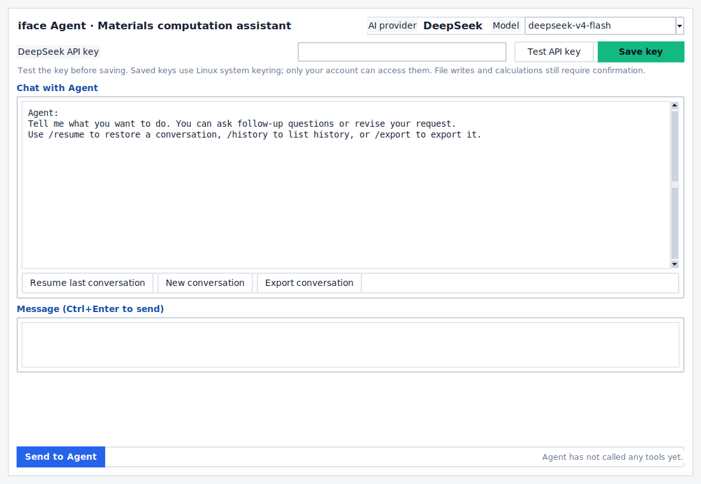
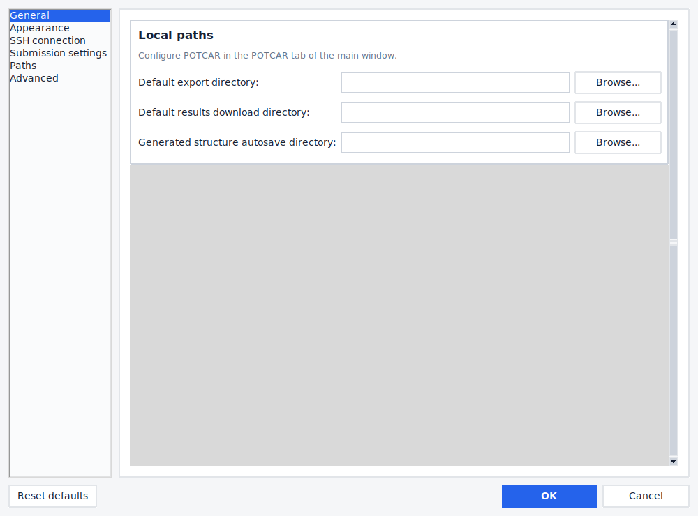

# iface for Linux

## Illustrated user guide for version 4.0.0

iface is a desktop application for building surface and interface structures, controlling the layer counts of materials A and B and their initial separation, preparing VASP inputs, managing calculations, and inspecting results. This guide describes the released software, with actual Linux screenshots and the button names shown in the English interface.

**Main workflow:** import structures → build surfaces or interfaces → scan layers and gaps → prepare inputs → run VASP on your server → analyze results and surface energy.

[Download version 4.0.0](https://github.com/liruanlin-beep/iface-linux/releases/tag/v4.0.0) · [Validation details](VALIDATION.md) · [Windows feature comparison](FEATURE_PARITY.md)

All screenshots use a local demonstration project. Al structures and displayed numerical fixtures illustrate the interface; they are not validated material properties or evidence of a completed production VASP calculation.


*Figure 1. The project tree is on the left, the structure viewer in the center, editing/slab controls on the right, and input/result tabs below the viewer.*

## Contents

1. [Implemented functions](#implemented-functions)
2. [Installation and first launch](#installation-and-first-launch)
3. [Finding your way around](#finding-your-way-around)
4. [Importing and editing a structure](#importing-and-editing-a-structure)
5. [Building a surface slab](#building-a-surface-slab)
6. [Building interfaces and scanning layers and gaps](#building-interfaces-and-scanning-layers-and-gaps)
7. [Preparing calculation inputs](#preparing-calculation-inputs)
8. [Connecting a server and managing tasks](#connecting-a-server-and-managing-tasks)
9. [Reading results and calculating surface energy](#reading-results-and-calculating-surface-energy)
10. [Charge difference and PDOS](#charge-difference-and-pdos)
11. [Using the AI assistant](#using-the-ai-assistant)
12. [Settings and saved files](#settings-and-saved-files)
13. [Troubleshooting and validation scope](#troubleshooting-and-validation-scope)

## Implemented functions

| Function | What the application does | What you supply |
| --- | --- | --- |
| Projects and structures | Project/task organization, structure import/export, multiple structure views, periodic cell display, rotation and zoom | A structure file; an Al example is included |
| Structure editing | Select/fix/replace/delete atoms, vacancies and adsorbates, supercells, distance/angle tools, undo/redo | The intended structural changes |
| Surface modeling | Miller orientation, layer-based slab generation, termination search, vacuum, bottom-layer fixing, preview and POSCAR export | Bulk structure and slab parameters |
| Interface modeling | A/B lattice matching, independent A/B layer ranges, gap scans, matching limits and candidate previews | A/B structures and scan ranges |
| Calculation preparation | POSCAR, INCAR, KPOINTS, POTCAR assembly and Slurm script preparation | Your licensed POTCAR library and system-specific settings |
| Workflows and queue | Relaxation/static/PDOS/charge-difference dependencies, persistent task records, deduplication, retry and recovery controls; default 10 in-flight jobs | A configured SSH/Slurm server with VASP |
| Results and scans | Energy/convergence/progress reading; layer/gap scan CSV/JSON and selected structures; surface-energy arithmetic | Completed VASP output and the required reference energy |
| Scientific post-processing | Three-system CHGCAR subtraction; PDOS plots; PNG/TIFF/PDF/SVG/Excel export; full charge grid in NPZ | Compatible CHGCAR files or a suitable vasprun.xml |
| Remote files | SSH/SFTP browsing, transfers, remote editing and an external SSH terminal | Server address, account and authentication |
| AI assistance | DeepSeek-based context analysis and controlled actions through 19 tools | Network access and your own DeepSeek API key |

Geometry construction, editing and local file preparation work without a server. VASP energies are produced by VASP on the configured computer/cluster, not by the viewer. The application can analyze existing output files without submitting new jobs.

**Input templates versus complete workflows.** All ten Windows input presets remain: `bulk_relax`, `surface_interface_relax`, `static`, `pdos`, `bader`, `charge_difference`, `neb`, `molecular_dynamics`, `vaspsol`, and `cohp`. A preset supplies starting INCAR parameters. In particular, the original `neb` preset does not provide a separate NEB path-generation/analysis workflow. Bader, COHP and solvation presets do not bundle their external analysis programs or a modified VASP executable.

## Installation and first launch

The tested environment is Ubuntu 24.04, Python 3.12 and Tk. Use a graphical Linux desktop; a Wayland session needs XWayland for Tk. On Ubuntu/Debian, install the system prerequisites:

```bash
sudo apt update
sudo apt install python3-venv python3-tk xdg-utils openssh-client gnome-keyring
```

Download `iface-linux-4.0.0-source.zip` or `iface_linux-4.0.0.tar.gz` from the release page and extract it. Open a terminal in the extracted directory containing `install.sh`:

```bash
bash install.sh
```

Run this as your normal desktop user. The installer creates a private Python environment and an Applications-menu launcher. It needs an internet connection for dependencies. Start **iface** from the Applications menu, or use the command printed by the installer. With the default data location, that command is:

```bash
~/.local/share/iface/4.0/venv/bin/iface
```

For a custom environment, use `bash install.sh --venv /your/path/iface-venv`. `--no-desktop` skips the launcher. The release also supplies a wheel for an existing Python 3.12+ environment; Tk and a graphical session are still required. VASP and licensed POTCAR files are not included.

## Finding your way around

| Region in Figure 1 | Purpose |
| --- | --- |
| Top toolbar | **Import structure**, **Structure tools**, **Generate inputs**, **High throughput**, **Task center**, **Post-processing plots**, **Server**, **iface Agent** |
| Left Project panel | Select structures/tasks; choose an export format, directory and file name |
| Center viewer | Inspect the model; use **A/B/C**, **Fit**, **+ / −**, **Home**, **Undo/Redo** and **View** |
| Right panel | **Selection** for atom operations; **Slab** for surface construction |
| Lower tabs | **INCAR**, **KPOINTS**, **POTCAR**, **Svasp.sh**, **Task monitoring**, **Results analysis** |

Drag the dividers to allocate more space to the viewer or lower panel. Scroll inside long panels. On narrow windows, use **More** for toolbar actions that do not fit. Multiple structures can be opened in separate tabs or viewer windows.

## Importing and editing a structure

1. Click **Import structure** and select a CIF, POSCAR, CONTCAR or supported VASP structure file. For a first local exercise, use `examples/Al/POSCAR` from the source archive. File drag-and-drop is also available.
2. Inspect the formula, cell and atom count in the viewer. Use **Fit** and the A/B/C view buttons to examine the model. The periodic display may show boundary images in addition to the atoms stored in the cell.
3. In **Selection**, choose click or box selection, then use **Fix Selection**, **Replace Selection** or **Delete Selection** as required. Fixed atoms are highlighted; check **Selective dynamics** when exporting fixed-coordinate flags.
4. Open **Structure tools** for supercells, vacuum/centering, bottom-layer fixing, defects/adsorbates and measurement controls. Undo/redo is available for supported structure edits.
5. In **Export structure** on the left, choose CIF or POSCAR, set the directory/file name and click **Export**. Generated structures also have an autosave directory.



*Figure 2. Structure tools provide explicit controls for modifying an existing model. Inspect and export the resulting geometry after each intended edit.*

## Building a surface slab

1. Select/import the intended **bulk** structure. Open the right-side **Slab** tab.
2. Enter **Miller Index** `(h k l)`, **Layer Count**, **Vacuum Thickness**, **Fixed bottom layers** and the layer-grouping tolerance.
3. Click **List terminations** and choose the required termination. **Preview Slab** lets you inspect the candidate before applying it.
4. Click **Generate Slab** for the selected termination, or **Generate Terminations** to generate the available termination variants.
5. Inspect the exposed faces, vacuum and fixed atoms. Click **Export POSCAR** or use the left export panel. For another slab from the same bulk, reselect the original bulk structure rather than repeatedly cutting the already generated slab.

**Current control behavior:** the 4.0.0 generation path uses **Layer Count**, not the visible **Slab Thickness** field. It automatically centers the generated slab; the visible **Center slab** checkbox is not passed as an independent generation option. In this surface generator, the vacuum value is applied on each side. Check the generated geometry/summary instead of treating the thickness field as an enforced constraint.



*Figure 3. Slab controls beside a generated surface. The image is a demonstration, not a recommended parameter set for every material.*

## Building interfaces and scanning layers and gaps

Open **High throughput**. This workspace is the main route for varying the two materials independently.

1. Use **Add...** under **Structure A** and **Structure B** to choose the input files. Multiple files are supported. Leaving B empty generates surface candidates for A; specifying both creates A × B interface combinations.
2. Set the A/B Miller orientations and each material's minimum layers, maximum layers and layer step.
3. Set the minimum/maximum **interface gap** and gap step, then set vacuum, strain, matching area, atom limit and candidates per gap.
4. Click **Search candidate structures**. The table reports the pair, layer counts, initial gap, terminations, atoms and geometric match score. Double-click a candidate to preview it. Scroll horizontally for columns to the right.
5. Scroll the parameter panel downward to set the output root and project name, magnetism, optional PDOS/charge-difference stages and any required DFT+U or dispersion settings.
6. Use **Create tasks for selected candidates** or **Create tasks for all candidates** to create the workflow files and task records. **Adaptive: relax A/B first** creates the original bulk-relaxation/rebuild route when both structures are supplied.
7. After the corresponding VASP static outputs are available locally, use **Scan energies and best structures**. It reads candidate `02_static/OUTCAR` files and writes `_scan_analysis/interface_scan_results.csv`, `interface_scan_results.json` and available selected structures under `best_structures`.

| Parameter | Meaning | Small tutorial scan |
| --- | --- | --- |
| A minimum/maximum/step | A-side layer range | 4 / 6 / 2 → 4, 6 |
| B minimum/maximum/step | B-side layer range | 4 / 4 / 1 → 4 |
| Minimum/maximum gap; step | Initial interface separation in Å | 2.0 / 2.5 / 0.5 → 2.0, 2.5 |
| Candidates per gap | Maximum retained candidates per scan group | 1 |
| Atom limit | Upper bound on candidate size | At most 1000 |
| Estimated models | Preflight limit across combinations | At most 300 |

For one A/B pair, this example has four layer-gap combinations before matching filters; fewer may be found. These are tutorial inputs, not optimized material parameters. A match score measures geometry, not electronic energy. Compare total energies across gaps only for the same A/B composition, layer counts and atom count. The cross-layer energy-per-atom ranking is preliminary screening, not an automatic interface formation-energy calculation.



*Figure 4. An illustrative A/B candidate list. The shown two-gap scan is separate from the four-combination tutorial above. Energy columns fill from calculation results, not from geometric matching.*

## Preparing calculation inputs

1. Select the intended structure/task in the project tree. Check the current task before generating files.
2. In **INCAR**, select the appropriate preset, generate it, review/edit parameters and use **Check INCAR**. Verify material-dependent quantities such as MAGMOM and DFT+U.
3. In **KPOINTS**, choose the mesh and centering mode. A slab's vacuum direction commonly uses a different sampling count from its in-plane directions; choose settings appropriate to your calculation.
4. In **POTCAR**, configure your licensed potential-library root, match the POSCAR element sequence, generate the combined file and validate it.
5. In **Svasp.sh** and **Settings → Submission settings**, set the actual cluster partition/account/resources, VASP launch command and environment initialization. Generate/review the script.
6. Click **Generate inputs**. Check that POSCAR, INCAR, KPOINTS, POTCAR and the configured submission script exist in the task directory. If POTCAR or another file cannot be generated, resolve the reported error before submission.

The dependent workflow can prepare relaxation → static → PDOS stages. Charge-difference workflows also prepare the isolated substrate/film systems and wait for their dependencies. File generation itself does not mean that a calculation has run.

## Connecting a server and managing tasks

1. Open **Server**. Enter the host, SSH port, username, authentication and remote project directory. The example directory in the UI must be replaced with a real writable location on your server.
2. Click **Test connection**, then **Connect**. Use the remote browser to confirm the destination.
3. For a single prepared task, choose **Upload current task**, then **Submit task**, or **Upload and submit**. Check the returned Slurm JobID and logs.
4. Open **Task center**. For a manually prepared current task, use **Add current task** if it is not already listed. Generated workflows already create task records.
5. Use **Start automatic queue** for queued dependent workflows. The default concurrent-job limit is 10 and can be configured. **Refresh local progress** reads local output; **Sync Slurm** queries the connected scheduler.
6. Select a task to view **Task details**, **Electronic iterations** and **Events and errors**. **Recovery suggestion**, **Pause/resume** and **Cancel task** operate on the selected record/workflow. **Remove record only** is not a substitute for cancelling a running remote job.
7. Download completed output through the remote tools before running local result/scan analysis. Use **Open task directory** to confirm which files are present.



*Figure 5. Server settings and transfer/submission actions. This screenshot shows an unconnected demonstration session.*



*Figure 6. Task queue, controls and details. The displayed entry is a test fixture, not a production job.*

## Reading results and calculating surface energy

1. Select the task whose local directory contains the completed `OUTCAR` and valid `CONTCAR`. If calculation ran remotely, download these files first.
2. Open the lower **Results analysis** tab and click **Read OUTCAR / CONTCAR**. Inspect the reported directory, energy, convergence and structure. Drag the horizontal divider upward if the fields are below the visible area.
3. The software fills the slab total energy from OUTCAR TOTEN, the atom count from CONTCAR and the oriented single-face area **A = |a × b|** from its lattice vectors.
4. Enter **Bulk energy per atom (eV)** from a consistent bulk reference calculation. Set **Surface count**, normally 2 for a slab with two equivalent surfaces.
5. Click **Calculate surface energy**. The GUI rereads the task files and requires a valid OUTCAR energy and CONTCAR geometry; typing a slab-energy number alone does not bypass that requirement.

The implemented expression is **γ = (E_slab − N × E_bulk,atom) / (n_surfaces × A)**. It reports eV/Ų and J/m², with 1 eV/Ų = 16.02176634 J/m². Use consistent energy settings and a physically appropriate bulk reference. Two inequivalent surfaces yield an average excess energy under this expression; it does not separately resolve their individual energies or automatically compute a heterointerface formation energy.



*Figure 7. Full surface-energy controls after enlarging the lower panel. For illustration only: −30 eV, −4 eV/atom, N = 8, A = 16.4025 Ų and two surfaces give approximately 0.976788 J/m². This is arithmetic test data, not an Al surface-energy prediction.*

## Charge difference and PDOS

Open **Post-processing plots** from the top toolbar.

### Charge density difference

1. Select the **Charge density difference** tab.
2. Choose the interface CHGCAR and the isolated substrate and film CHGCAR files. The component calculations must use the same simulation cell/grid and the corresponding component positions from the interface geometry.
3. Choose an output directory. Enable full-grid Excel output only when you need that large table.
4. Click **Validate grid, calculate and export**. The operation uses **Δρ = ρ(interface) − ρ(isolated substrate) − ρ(isolated film)**, checks cell/grid compatibility and exports plots and data.
5. Use **Open output directory** to inspect the PNG/TIFF/PDF/SVG plots, Excel workbook and compressed NPZ full-grid data. A grid mismatch must be corrected in the input calculations; the tool does not silently align incompatible grids.



*Figure 8. Three CHGCAR inputs and export settings.*

### Projected density of states

1. Select **PDOS**, then browse to a `vasprun.xml` containing the DOS/projection data required by the plotter.
2. Choose the output directory and click **Read PDOS and export plots and Excel**.
3. Inspect the exported total and element/orbital contributions. The plotted energy axis is shifted to E − E_F; spin-down DOS is drawn negative, while the Excel data retain its original positive values.



*Figure 9. PDOS reads calculation output; opening this page alone does not produce a DOS calculation. Raster figure exports use 600 dpi; vector PDF/SVG exports remain available.*

## Using the AI assistant

1. Open **iface Agent**, select the supported DeepSeek model and enter your API key.
2. Use **Test API key**, then **Save key** if desired. Linux persistence requires an unlocked Secret Service keyring, such as GNOME Keyring.
3. Ask a concrete question about the current structure, input or results, for example: “Inspect the current task and explain which input files are missing.”
4. Review proposed actions and parameter changes. Actions involving writes, uploads or calculations use the application's approval controls. Check the intended task and files before accepting.
5. Use **New conversation**, **Resume last conversation** and **Export conversation** to manage discussions.

The assistant requires a live external API. Its suggestions do not replace structural checks, convergence studies or inspection of calculation output.



*Figure 10. Agent connection and conversation controls. No live API request was made for this screenshot.*

## Settings and saved files

Open **Settings** for general preferences, appearance/background, paths, SSH connection and submission settings. Configure POTCAR in the main window's **POTCAR** tab. The English interface is the default; language selection remains available, but switching it does not translate every hard-coded label.



*Figure 11. Export, result-download and generated-structure directories.*

| Item | Default or behavior |
| --- | --- |
| Installed Python environment | `${XDG_DATA_HOME:-$HOME/.local/share}/iface/4.0/venv` |
| Application data | `${XDG_DATA_HOME:-$HOME/.local/share}/iface/2.0` — `2.0` identifies the retained data layout |
| Application data override | Set `IFACE_DATA_DIR` before launch |
| Data subdirectories | `config`, `projects`, `outputs`, `database`, `logs` |
| Generated structures and scan outputs | The configured autosave/output directories; inspect messages and the task directory |
| File/folder opening | Linux `xdg-open` and the desktop file associations |
| Remote-file editor | `editor_command` in configuration, then `$VISUAL`/`$EDITOR`, otherwise the desktop association |
| External SSH terminal | A native terminal plus `ssh`; `ssh_terminal_command` may be configured |
| Saved AI key | Native Secret Service entry; the configuration keeps its reference |

Back up your projects, task database and configuration together if you need to preserve local workflow records. Windows DPAPI-encrypted credentials must be re-entered on Linux.

## Troubleshooting and validation scope

| Symptom | What to check |
| --- | --- |
| No window or missing Tk | Use a graphical session and install `python3-tk`; inspect the terminal error |
| A toolbar action or form is missing | Open **More**, show the side panel, drag the divider or scroll inside the panel |
| No interface candidates | Confirm A/B files and orientations; inspect strain/area/atom limits and reduce the scan to one pair |
| More than 300 estimated models | Reduce file combinations, layer/gap ranges or candidates per group |
| POTCAR cannot be generated | Check the library path, element availability and POSCAR element order |
| Submission fails or no JobID appears | Inspect connection/logs, writable remote path, Slurm commands and environment initialization; reconcile an uncertain submission before retrying |
| Scan energies are empty | Ensure candidate `02_static/OUTCAR` files are available under the selected output root/project |
| Surface energy is unavailable | Check OUTCAR TOTEN, valid CONTCAR, bulk reference energy and surface count |
| CHGCAR subtraction is rejected | Use matching cells and FFT grids for all three systems |
| API key cannot be saved | Unlock/start the desktop Secret Service keyring |

Version 4.0.0 passed 116 tests with one Windows-only test skipped, 15 offline GUI smoke steps, native Linux keyring checks, installed-package acceptance and Ubuntu CI. Those checks exercise synthetic/local data and mock queue behavior. Real production SSH/Slurm/VASP execution and live DeepSeek responses were not part of release acceptance. Visible legacy fields and input templates should be interpreted as described above, rather than as additional completed scientific workflows.

For developers, the following commands repeat the source-retention check, regression suite and isolated offline self-test in an installed environment:

```bash
python tools/verify_feature_parity.py --report parity-report.json
xvfb-run -a python -m unittest discover -s tests -v
iface --self-test /tmp/iface-acceptance.json
```

Run the last command under `xvfb-run -a` on a headless machine. Source code is in `app/core` and `app/ui`. See [VALIDATION.md](VALIDATION.md), [FEATURE_PARITY.md](FEATURE_PARITY.md), [NOTICE.md](NOTICE.md) and [CHANGELOG.md](CHANGELOG.md). This documentation update changes no software functions or manuscript content.
